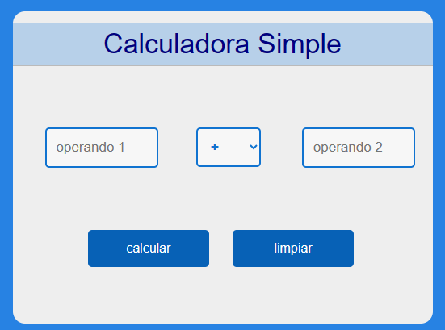

#Calculadora Simple

_Calculadora simple es solo eso, una simple claculadora **aritmetica** básica para ser usada desde un navegador de internet._

##Descripción de funcionalidad

_La calculadora soporta las siguientes operaciones:_

```
+ - * / %
```
_Trabaja con numeros enteros y decimales (punto flotante),_
_por ejemplo:_
~~~
enteros:                33  356
enteros negativos:      -33  -99
decimales:              0.456   76.9
decimales negativos:    -56.2   -0.34
~~~
`Ojo: es importante tener en cuenta que el simbolo decimal tiene que ser un punto(.) y no una coma(,)`

_La calculadora emitira alertas en caso de ingresar elementos no válidos, ó cuando los calculos esten fuera de rango_

##Cómo usar

_La calculadora cuenta con:_

* Dos campos para ingresar los valores de los operandos, indicados en gris como **Operando1** y **Operando2**, donde debemos ingresar los numeros sobre los que queremos operar.
* Un selector despleglabe para selecionar la operacion que queremos realizar sobre los operandos.
* Un botón **'Calcular'**, para procesar el calculo selecionado.
* Un botón **'Limpiar'** para borrar los campos de de entrada y salida.



_La operatoria es cencilla, se introducen los numeros sobre los que se desea operar en los campos **'Operando'** (ojo, tener en cuenta el orden), se selecciona la operación que se desea realizar y se oprime el botón **'Calcular'**.
En la parte inferiór apareerá el resultado._

##Validaciones/Pruebas realizadas
_**A** - Se incorporó la validación de ingresar números (reales) sin espacios, emitiendo una alerta en caso de que incumplimiento:_
```
if (isNaN(operando1) || isNaN(operando2) || oper1.indexOf(" ") != -1 || oper2.indexOf(" ") != -1) {
            alert("Debe ingresar números flotante válidos, sin espacios");}
```

_**B** - Se incorporó la validación de no divición por cero, emitiendo una alerta en caso de que incumplimiento:_

```
if (operando2==0 && operador=='/'){
            alert("No se permite la división por cero");}
```
_**C** - Se incorporó la validación de existencia de campos vacios, emitiendo una alerta en caso de que incumplimiento:_

```
if (oper1=="" || oper2==""){
            alert("Debe ingresar números en todos los campos");}
```
_**D** - Se incorporó la verificación de resultados (salida) demaciado grandes o pequeños, emitiendo una alerta en caso de que incumplimiento:_

```
if (99999999999999999999 < Math.abs(res)) {
                alert("El resultado es demasiado grande para ser mostrado");
            } else if (0.0000001 > Math.abs(res)) {
                alert("El resultado es demasiado pequeño para ser mostrado");
            } else {
                document.getElementById("resultado").innerHTML = res;}
```
_**F** - Se utilizó el manejador de Strings **'Number()'** para convertir strings de texto en numeros, este convertidos soporta números flotantes, por lo que resultó ideal_
```
let operando1 = Number(oper1);
```
_En este punto se detectó que la función **'Numbers()'** completaba como cero (0) los campos vacios, y eliminaba los espacios adelante y atras del texto ingresado para convertirlos en números, por lo cual, (y con el objetivo de cimplir la consigna generar alerta en el caso de campos vacios y espacios) se incorporó una de las validaciones del punto A._


